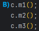

# Mixed messages

A short Java program is listed below. One block of the program is missing! 

___

___

___

___

Your challenge is to match the candidates blocks of code, with the output that you’d see if the block were inserted.

Output:
`B's m1, A's m2, C's m3, 13`

|  |  |  |  |
|----------------------------|----------------------------|----------------------------|----------------------------|
